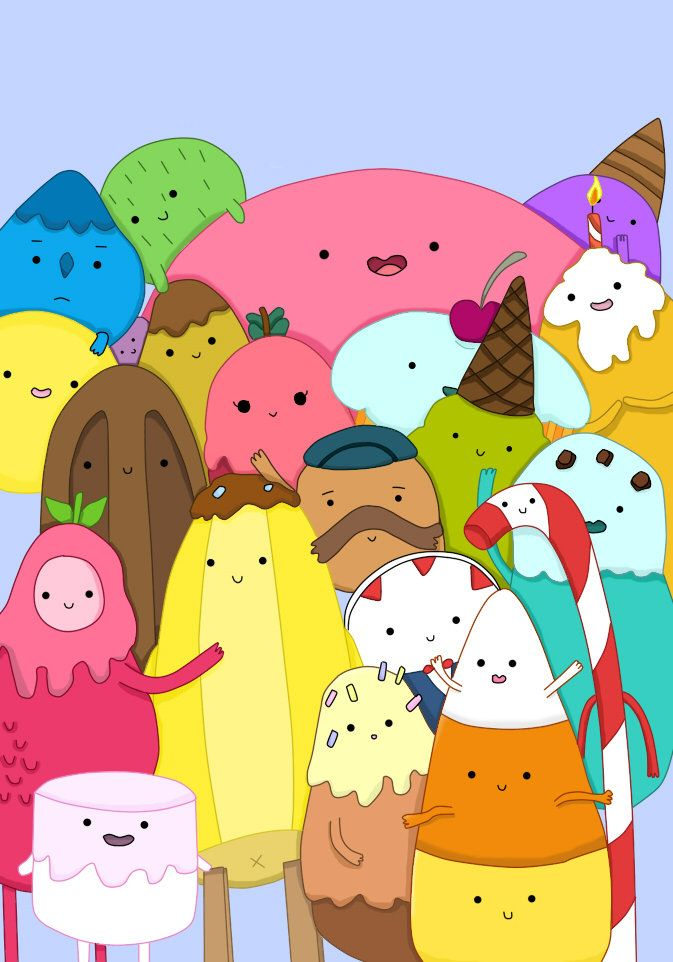

```{r setup, include=FALSE}
knitr::opts_chunk$set(echo = TRUE, warning = FALSE, message = FALSE)
```

## Halloween Hackathon 2020

Candy, candy, candy!!


### Data
```{r}
library(tidyverse)
#library(gsheet)
candy <- read_csv("data/candy_2020.csv")

```

